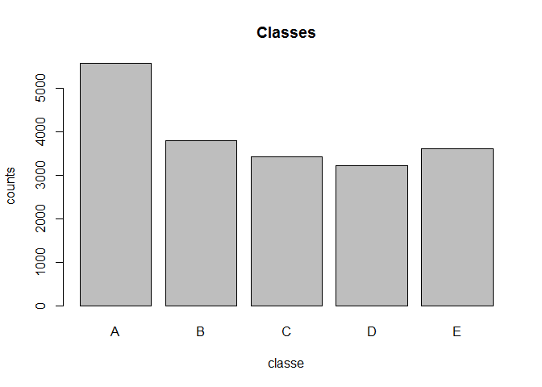
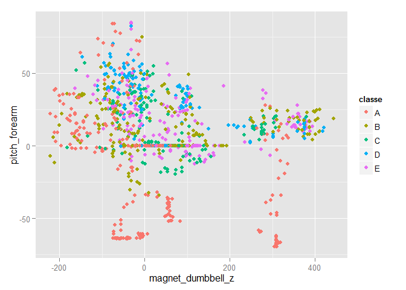

\# Machine Learning Project
===========================

Initial setup.

    library(caret)

    ## Warning: package 'caret' was built under R version 3.2.3

    ## Loading required package: lattice

    ## Warning: package 'lattice' was built under R version 3.2.2

    ## Loading required package: ggplot2

    ## Warning: package 'ggplot2' was built under R version 3.2.2

    library(ggplot2)
    set.seed(88388)
    # setwd("/Users/01043/Google Drive/coursera/ProjectMACHLEARNING")

Data analysis
-------------

Read training data and plot some statistics, e.g., frequency of classes
(A through E). The task is to predict activity classes from accelerator
measurements of participants performing barbell exercises.

    trainRaw=read.table("pml-training.csv",header=TRUE,sep=",")  
    barplot(table(trainRaw$classe),xlab="classe",ylab="counts",main="Classes")

    dim(trainRaw)

    ## [1] 19622   160

The training file is rather balanced (more of class A, but not very
skewed) and has 19622 instances and 159 variables (the 160th variable is
the output to predict, called "classe" that is a factor with 5 levels).
The `str` command shows that many columns contain lots of NA's and that
a lot of real-valued data is surrounded by quotes and was thus
interpreted incorrectly as factor.

Data preparation
----------------

We now remove all data columns which consist of more than 90% NAs. The
data set has now a much lower dimension (93 columns).

    train=trainRaw[,colSums(is.na(trainRaw))<(nrow(trainRaw)*0.9)]
    dim(train)

    ## [1] 19622    93

For the remaining columns, we inspect them with `str` to remove those
that make less sense (i.e., counters, meta-data, time-related columns).

    #names(train)
    str(train)

    ## 'data.frame':    19622 obs. of  93 variables:
    ##  $ X                      : int  1 2 3 4 5 6 7 8 9 10 ...
    ##  $ user_name              : Factor w/ 6 levels "adelmo","carlitos",..: 2 2 2 2 2 2 2 2 2 2 ...
    ##  $ raw_timestamp_part_1   : int  1323084231 1323084231 1323084231 1323084232 1323084232 1323084232 1323084232 1323084232 1323084232 1323084232 ...
    ##  $ raw_timestamp_part_2   : int  788290 808298 820366 120339 196328 304277 368296 440390 484323 484434 ...
    ##  $ cvtd_timestamp         : Factor w/ 20 levels "02/12/2011 13:32",..: 9 9 9 9 9 9 9 9 9 9 ...
    ##  $ new_window             : Factor w/ 2 levels "no","yes": 1 1 1 1 1 1 1 1 1 1 ...
    ##  $ num_window             : int  11 11 11 12 12 12 12 12 12 12 ...
    ##  $ roll_belt              : num  1.41 1.41 1.42 1.48 1.48 1.45 1.42 1.42 1.43 1.45 ...
    ##  $ pitch_belt             : num  8.07 8.07 8.07 8.05 8.07 8.06 8.09 8.13 8.16 8.17 ...
    ##  $ yaw_belt               : num  -94.4 -94.4 -94.4 -94.4 -94.4 -94.4 -94.4 -94.4 -94.4 -94.4 ...
    ##  $ total_accel_belt       : int  3 3 3 3 3 3 3 3 3 3 ...
    ##  $ kurtosis_roll_belt     : Factor w/ 397 levels "","-0.016850",..: 1 1 1 1 1 1 1 1 1 1 ...
    ##  $ kurtosis_picth_belt    : Factor w/ 317 levels "","-0.021887",..: 1 1 1 1 1 1 1 1 1 1 ...
    ##  $ kurtosis_yaw_belt      : Factor w/ 2 levels "","#DIV/0!": 1 1 1 1 1 1 1 1 1 1 ...
    ##  $ skewness_roll_belt     : Factor w/ 395 levels "","-0.003095",..: 1 1 1 1 1 1 1 1 1 1 ...
    ##  $ skewness_roll_belt.1   : Factor w/ 338 levels "","-0.005928",..: 1 1 1 1 1 1 1 1 1 1 ...
    ##  $ skewness_yaw_belt      : Factor w/ 2 levels "","#DIV/0!": 1 1 1 1 1 1 1 1 1 1 ...
    ##  $ max_yaw_belt           : Factor w/ 68 levels "","-0.1","-0.2",..: 1 1 1 1 1 1 1 1 1 1 ...
    ##  $ min_yaw_belt           : Factor w/ 68 levels "","-0.1","-0.2",..: 1 1 1 1 1 1 1 1 1 1 ...
    ##  $ amplitude_yaw_belt     : Factor w/ 4 levels "","#DIV/0!","0.00",..: 1 1 1 1 1 1 1 1 1 1 ...
    ##  $ gyros_belt_x           : num  0 0.02 0 0.02 0.02 0.02 0.02 0.02 0.02 0.03 ...
    ##  $ gyros_belt_y           : num  0 0 0 0 0.02 0 0 0 0 0 ...
    ##  $ gyros_belt_z           : num  -0.02 -0.02 -0.02 -0.03 -0.02 -0.02 -0.02 -0.02 -0.02 0 ...
    ##  $ accel_belt_x           : int  -21 -22 -20 -22 -21 -21 -22 -22 -20 -21 ...
    ##  $ accel_belt_y           : int  4 4 5 3 2 4 3 4 2 4 ...
    ##  $ accel_belt_z           : int  22 22 23 21 24 21 21 21 24 22 ...
    ##  $ magnet_belt_x          : int  -3 -7 -2 -6 -6 0 -4 -2 1 -3 ...
    ##  $ magnet_belt_y          : int  599 608 600 604 600 603 599 603 602 609 ...
    ##  $ magnet_belt_z          : int  -313 -311 -305 -310 -302 -312 -311 -313 -312 -308 ...
    ##  $ roll_arm               : num  -128 -128 -128 -128 -128 -128 -128 -128 -128 -128 ...
    ##  $ pitch_arm              : num  22.5 22.5 22.5 22.1 22.1 22 21.9 21.8 21.7 21.6 ...
    ##  $ yaw_arm                : num  -161 -161 -161 -161 -161 -161 -161 -161 -161 -161 ...
    ##  $ total_accel_arm        : int  34 34 34 34 34 34 34 34 34 34 ...
    ##  $ gyros_arm_x            : num  0 0.02 0.02 0.02 0 0.02 0 0.02 0.02 0.02 ...
    ##  $ gyros_arm_y            : num  0 -0.02 -0.02 -0.03 -0.03 -0.03 -0.03 -0.02 -0.03 -0.03 ...
    ##  $ gyros_arm_z            : num  -0.02 -0.02 -0.02 0.02 0 0 0 0 -0.02 -0.02 ...
    ##  $ accel_arm_x            : int  -288 -290 -289 -289 -289 -289 -289 -289 -288 -288 ...
    ##  $ accel_arm_y            : int  109 110 110 111 111 111 111 111 109 110 ...
    ##  $ accel_arm_z            : int  -123 -125 -126 -123 -123 -122 -125 -124 -122 -124 ...
    ##  $ magnet_arm_x           : int  -368 -369 -368 -372 -374 -369 -373 -372 -369 -376 ...
    ##  $ magnet_arm_y           : int  337 337 344 344 337 342 336 338 341 334 ...
    ##  $ magnet_arm_z           : int  516 513 513 512 506 513 509 510 518 516 ...
    ##  $ kurtosis_roll_arm      : Factor w/ 330 levels "","-0.02438",..: 1 1 1 1 1 1 1 1 1 1 ...
    ##  $ kurtosis_picth_arm     : Factor w/ 328 levels "","-0.00484",..: 1 1 1 1 1 1 1 1 1 1 ...
    ##  $ kurtosis_yaw_arm       : Factor w/ 395 levels "","-0.01548",..: 1 1 1 1 1 1 1 1 1 1 ...
    ##  $ skewness_roll_arm      : Factor w/ 331 levels "","-0.00051",..: 1 1 1 1 1 1 1 1 1 1 ...
    ##  $ skewness_pitch_arm     : Factor w/ 328 levels "","-0.00184",..: 1 1 1 1 1 1 1 1 1 1 ...
    ##  $ skewness_yaw_arm       : Factor w/ 395 levels "","-0.00311",..: 1 1 1 1 1 1 1 1 1 1 ...
    ##  $ roll_dumbbell          : num  13.1 13.1 12.9 13.4 13.4 ...
    ##  $ pitch_dumbbell         : num  -70.5 -70.6 -70.3 -70.4 -70.4 ...
    ##  $ yaw_dumbbell           : num  -84.9 -84.7 -85.1 -84.9 -84.9 ...
    ##  $ kurtosis_roll_dumbbell : Factor w/ 398 levels "","-0.0035","-0.0073",..: 1 1 1 1 1 1 1 1 1 1 ...
    ##  $ kurtosis_picth_dumbbell: Factor w/ 401 levels "","-0.0163","-0.0233",..: 1 1 1 1 1 1 1 1 1 1 ...
    ##  $ kurtosis_yaw_dumbbell  : Factor w/ 2 levels "","#DIV/0!": 1 1 1 1 1 1 1 1 1 1 ...
    ##  $ skewness_roll_dumbbell : Factor w/ 401 levels "","-0.0082","-0.0096",..: 1 1 1 1 1 1 1 1 1 1 ...
    ##  $ skewness_pitch_dumbbell: Factor w/ 402 levels "","-0.0053","-0.0084",..: 1 1 1 1 1 1 1 1 1 1 ...
    ##  $ skewness_yaw_dumbbell  : Factor w/ 2 levels "","#DIV/0!": 1 1 1 1 1 1 1 1 1 1 ...
    ##  $ max_yaw_dumbbell       : Factor w/ 73 levels "","-0.1","-0.2",..: 1 1 1 1 1 1 1 1 1 1 ...
    ##  $ min_yaw_dumbbell       : Factor w/ 73 levels "","-0.1","-0.2",..: 1 1 1 1 1 1 1 1 1 1 ...
    ##  $ amplitude_yaw_dumbbell : Factor w/ 3 levels "","#DIV/0!","0.00": 1 1 1 1 1 1 1 1 1 1 ...
    ##  $ total_accel_dumbbell   : int  37 37 37 37 37 37 37 37 37 37 ...
    ##  $ gyros_dumbbell_x       : num  0 0 0 0 0 0 0 0 0 0 ...
    ##  $ gyros_dumbbell_y       : num  -0.02 -0.02 -0.02 -0.02 -0.02 -0.02 -0.02 -0.02 -0.02 -0.02 ...
    ##  $ gyros_dumbbell_z       : num  0 0 0 -0.02 0 0 0 0 0 0 ...
    ##  $ accel_dumbbell_x       : int  -234 -233 -232 -232 -233 -234 -232 -234 -232 -235 ...
    ##  $ accel_dumbbell_y       : int  47 47 46 48 48 48 47 46 47 48 ...
    ##  $ accel_dumbbell_z       : int  -271 -269 -270 -269 -270 -269 -270 -272 -269 -270 ...
    ##  $ magnet_dumbbell_x      : int  -559 -555 -561 -552 -554 -558 -551 -555 -549 -558 ...
    ##  $ magnet_dumbbell_y      : int  293 296 298 303 292 294 295 300 292 291 ...
    ##  $ magnet_dumbbell_z      : num  -65 -64 -63 -60 -68 -66 -70 -74 -65 -69 ...
    ##  $ roll_forearm           : num  28.4 28.3 28.3 28.1 28 27.9 27.9 27.8 27.7 27.7 ...
    ##  $ pitch_forearm          : num  -63.9 -63.9 -63.9 -63.9 -63.9 -63.9 -63.9 -63.8 -63.8 -63.8 ...
    ##  $ yaw_forearm            : num  -153 -153 -152 -152 -152 -152 -152 -152 -152 -152 ...
    ##  $ kurtosis_roll_forearm  : Factor w/ 322 levels "","-0.0227","-0.0359",..: 1 1 1 1 1 1 1 1 1 1 ...
    ##  $ kurtosis_picth_forearm : Factor w/ 323 levels "","-0.0073","-0.0442",..: 1 1 1 1 1 1 1 1 1 1 ...
    ##  $ kurtosis_yaw_forearm   : Factor w/ 2 levels "","#DIV/0!": 1 1 1 1 1 1 1 1 1 1 ...
    ##  $ skewness_roll_forearm  : Factor w/ 323 levels "","-0.0004","-0.0013",..: 1 1 1 1 1 1 1 1 1 1 ...
    ##  $ skewness_pitch_forearm : Factor w/ 319 levels "","-0.0113","-0.0131",..: 1 1 1 1 1 1 1 1 1 1 ...
    ##  $ skewness_yaw_forearm   : Factor w/ 2 levels "","#DIV/0!": 1 1 1 1 1 1 1 1 1 1 ...
    ##  $ max_yaw_forearm        : Factor w/ 45 levels "","-0.1","-0.2",..: 1 1 1 1 1 1 1 1 1 1 ...
    ##  $ min_yaw_forearm        : Factor w/ 45 levels "","-0.1","-0.2",..: 1 1 1 1 1 1 1 1 1 1 ...
    ##  $ amplitude_yaw_forearm  : Factor w/ 3 levels "","#DIV/0!","0.00": 1 1 1 1 1 1 1 1 1 1 ...
    ##  $ total_accel_forearm    : int  36 36 36 36 36 36 36 36 36 36 ...
    ##  $ gyros_forearm_x        : num  0.03 0.02 0.03 0.02 0.02 0.02 0.02 0.02 0.03 0.02 ...
    ##  $ gyros_forearm_y        : num  0 0 -0.02 -0.02 0 -0.02 0 -0.02 0 0 ...
    ##  $ gyros_forearm_z        : num  -0.02 -0.02 0 0 -0.02 -0.03 -0.02 0 -0.02 -0.02 ...
    ##  $ accel_forearm_x        : int  192 192 196 189 189 193 195 193 193 190 ...
    ##  $ accel_forearm_y        : int  203 203 204 206 206 203 205 205 204 205 ...
    ##  $ accel_forearm_z        : int  -215 -216 -213 -214 -214 -215 -215 -213 -214 -215 ...
    ##  $ magnet_forearm_x       : int  -17 -18 -18 -16 -17 -9 -18 -9 -16 -22 ...
    ##  $ magnet_forearm_y       : num  654 661 658 658 655 660 659 660 653 656 ...
    ##  $ magnet_forearm_z       : num  476 473 469 469 473 478 470 474 476 473 ...
    ##  $ classe                 : Factor w/ 5 levels "A","B","C","D",..: 1 1 1 1 1 1 1 1 1 1 ...

    #remove columns
    train=subset(train, select=-c(X,user_name,raw_timestamp_part_1,raw_timestamp_part_2,cvtd_timestamp,new_window,num_window, kurtosis_yaw_belt,skewness_yaw_belt,max_yaw_belt,min_yaw_belt,amplitude_yaw_belt,kurtosis_yaw_dumbbell,skewness_yaw_dumbbell,amplitude_yaw_dumbbell,amplitude_yaw_dumbbell,skewness_yaw_forearm,amplitude_yaw_forearm,min_yaw_forearm,max_yaw_forearm,skewness_pitch_forearm,skewness_roll_forearm,kurtosis_yaw_forearm,kurtosis_picth_forearm,kurtosis_roll_forearm,max_yaw_dumbbell,min_yaw_dumbbell ))
    dim(train)

    ## [1] 19622    67

    #summary(train)

We are now down to 67 columns. Inspect again and make sure that all
columns are in the right format, otherwise cast them.

    train$kurtosis_roll_belt=as.numeric(train$kurtosis_roll_belt)
    train$kurtosis_picth_belt=as.numeric(train$kurtosis_picth_belt)
    train$skewness_roll_belt=as.numeric(train$skewness_roll_belt)
    train$skewness_roll_belt.1=as.numeric(train$skewness_roll_belt.1)
    train$kurtosis_roll_arm=as.numeric(train$kurtosis_roll_arm)
    train$kurtosis_picth_arm=as.numeric(train$kurtosis_picth_arm)
    train$kurtosis_yaw_arm=as.numeric(train$kurtosis_yaw_arm)
    train$skewness_roll_arm=as.numeric(train$skewness_roll_arm)
    train$skewness_pitch_arm=as.numeric(train$skewness_pitch_arm)
    train$skewness_yaw_arm=as.numeric(train$skewness_yaw_arm)
    train$kurtosis_roll_dumbbell=as.numeric(train$kurtosis_roll_dumbbell)
    train$kurtosis_picth_dumbbell=as.numeric(train$kurtosis_picth_dumbbell)
    train$skewness_roll_dumbbell=as.numeric(train$skewness_roll_dumbbell)
    train$skewness_pitch_dumbbell=as.numeric(train$skewness_pitch_dumbbell)

Now the train data is in the right format, and lets train models.

Train models on selected data and evaluate on held-out set
----------------------------------------------------------

We now split the data into parts, and for initial inspection train
models only on a random sample of 1000 train and 1000 dev instances to
select which method to take. We use Naive Bayes (NB) as baseline method.
Since the measurements are clearly not independent, we expect it to work
badly. We expect random forests to work well, and compare them to
support vector machines (SVM) with a linear and polynomial kernel.

    inTrain <- createDataPartition(train$classe, p=0.7,list=FALSE) #same as [[1]] instead of list=FALSE
    length(inTrain)

    ## [1] 13737

    inTrain=sample(inTrain,size=1000,replace=FALSE) #subset for testing
    training <- train[inTrain,]
    testing <- train[-inTrain,]
    testing=testing[sample(nrow(testing), 1000),] #random rows
    # we try several models for fun
    model=train(classe~.,data=training,method="rf")

    ## Loading required package: randomForest

    ## Warning: package 'randomForest' was built under R version 3.2.3

    ## randomForest 4.6-12
    ## Type rfNews() to see new features/changes/bug fixes.

    #model=train(classe~.,data=training,method="nb")
    #model=train(classe~.,data=training,method="svmLinear")
    #model=train(classe~.,data=training,method="svmPoly")
    model

    ## Random Forest 
    ## 
    ## 1000 samples
    ##   66 predictor
    ##    5 classes: 'A', 'B', 'C', 'D', 'E' 
    ## 
    ## No pre-processing
    ## Resampling: Bootstrapped (25 reps) 
    ## Summary of sample sizes: 1000, 1000, 1000, 1000, 1000, 1000, ... 
    ## Resampling results across tuning parameters:
    ## 
    ##   mtry  Accuracy   Kappa      Accuracy SD  Kappa SD  
    ##    2    0.8542462  0.8153583  0.02355312   0.02961382
    ##   34    0.8751869  0.8420614  0.02226489   0.02817129
    ##   66    0.8613215  0.8246323  0.02588315   0.03269695
    ## 
    ## Accuracy was used to select the optimal model using  the largest value.
    ## The final value used for the model was mtry = 34.

    predictions=predict(model,newdata=testing)
    accuracy=sum(predictions == testing$classe)/length(testing$classe) #or:
    confusionMatrix(predictions,testing$classe)

    ## Confusion Matrix and Statistics
    ## 
    ##           Reference
    ## Prediction   A   B   C   D   E
    ##          A 247   7   0   3   0
    ##          B  10 173   7   1   5
    ##          C   8   7 176  12   7
    ##          D   6   3   4 138   3
    ##          E   4   0   1   2 176
    ## 
    ## Overall Statistics
    ##                                          
    ##                Accuracy : 0.91           
    ##                  95% CI : (0.8905, 0.927)
    ##     No Information Rate : 0.275          
    ##     P-Value [Acc > NIR] : < 2.2e-16      
    ##                                          
    ##                   Kappa : 0.8866         
    ##  Mcnemar's Test P-Value : 0.001659       
    ## 
    ## Statistics by Class:
    ## 
    ##                      Class: A Class: B Class: C Class: D Class: E
    ## Sensitivity            0.8982   0.9105   0.9362   0.8846   0.9215
    ## Specificity            0.9862   0.9716   0.9581   0.9810   0.9913
    ## Pos Pred Value         0.9611   0.8827   0.8381   0.8961   0.9617
    ## Neg Pred Value         0.9623   0.9789   0.9848   0.9787   0.9816
    ## Prevalence             0.2750   0.1900   0.1880   0.1560   0.1910
    ## Detection Rate         0.2470   0.1730   0.1760   0.1380   0.1760
    ## Detection Prevalence   0.2570   0.1960   0.2100   0.1540   0.1830
    ## Balanced Accuracy      0.9422   0.9411   0.9471   0.9328   0.9564

In fact, the worst model is naive Bayes (NB). The best model is -- as
expected -- random forest. More specifically, on the 1000 data sample,
the accuracies we get are:

-   NB accuracy: 60%,
-   RF accuracy: 90.8%
-   svmLinear: 69.7%
-   svmPoly: 80.1%

Feature selection
-----------------

We now want to find the top-20 features of the RF model and train on the
whole data set partition.

    varImp(model)

    ## rf variable importance
    ## 
    ##   only 20 most important variables shown (out of 66)
    ## 
    ##                      Overall
    ## roll_belt             100.00
    ## pitch_forearm          80.83
    ## yaw_belt               52.34
    ## magnet_dumbbell_y      43.49
    ## magnet_dumbbell_z      42.29
    ## roll_forearm           33.06
    ## pitch_belt             28.60
    ## roll_dumbbell          25.64
    ## magnet_dumbbell_x      21.41
    ## accel_forearm_x        21.39
    ## accel_dumbbell_y       20.57
    ## magnet_belt_z          18.14
    ## magnet_belt_y          16.41
    ## total_accel_dumbbell   15.98
    ## magnet_forearm_z       15.43
    ## gyros_belt_z           14.56
    ## accel_belt_z           14.22
    ## accel_dumbbell_z       13.41
    ## roll_arm               12.56
    ## magnet_arm_y           12.40

Lets plot some of these features to get a feeling how well they
distinguish the classes.

    qplot(magnet_dumbbell_z,pitch_forearm,data=training,color=classe)

The figure above shows that, for instance, class A and D are nicely
separable using this two variables.

We now use only the top-20 features to train an RF model.

    inTrain <- createDataPartition(train$classe, p=0.7,list=FALSE) #same as [[1]] instead of list=FALSE
    length(inTrain)
    training <- train[inTrain,]
    testing <- train[-inTrain,]
    training=subset(training,select=c(roll_belt,pitch_forearm,magnet_dumbbell_z,magnet_dumbbell_y,yaw_belt,pitch_belt,roll_forearm,magnet_dumbbell_x,roll_dumbbell,magnet_belt_z,accel_forearm_x,accel_dumbbell_y,gyros_dumbbell_y,roll_arm,magnet_belt_x,accel_belt_z,magnet_belt_y,accel_dumbbell_z,magnet_forearm_x ,magnet_forearm_x,total_accel_dumbbell,classe))
    testing=subset(testing,select=c(roll_belt,pitch_forearm,magnet_dumbbell_z,magnet_dumbbell_y,yaw_belt,pitch_belt,roll_forearm,magnet_dumbbell_x,roll_dumbbell,magnet_belt_z,accel_forearm_x,accel_dumbbell_y,gyros_dumbbell_y,roll_arm,magnet_belt_x,accel_belt_z,magnet_belt_y,accel_dumbbell_z,magnet_forearm_x ,magnet_forearm_x,total_accel_dumbbell,classe))
    dim(training)

We get the same accuracy (88.9%) but this is faster to train (takes 2/3
of the time). We will use this set of features with RF for our final
model.

So far we have trained models on only a subset of the data. To get an
estimate of the out-of-sample error we train a random forest model on
the whole training data using cross-validation.

    fitControl <- trainControl(## 10-fold CV
                               method = "repeatedcv",
                               number = 10,
                               repeats = 10)
    model=train(classe~.,data=training,method="rf",trControl=fitControl)

This takes quite some time to finish, nevertheless, from the cross
validation accuracy (98.9%) we can get an estimated of the out-of-sample
performance.

Final model
-----------

Now we train the final model using the seleted features on the entire
training data set and evaluate it on the test set of 20 instances.

    model=train(classe~.,data=training,method="rf")
    predictions=predict(model,newdata=testing)
    accuracy=sum(predictions == testing$classe)/length(testing$classe) #or:
    accuracy
    confusionMatrix(predictions,testing$classe)

We reach an accuracy of 99.81% on the held-out set. More specifically,
the sensitivity and specificity per class is, respectively: A
0.9988/0.9993, B 0.9939/0.9992, C 0.9981/0.9992, D 1.0/1.0, E 1.0/1.0.

Now we run it on the real test data and write the predictions to the
files. Submitting the test run on the website shows that we actually got
an accuracy of 100% (with just 20 features). Thus, our estimate carried
nicely over. Yeah!

    testRaw=read.table("data/pml-testing.csv",header=TRUE,sep=",")  
    testing=subset(testRaw,select=c(roll_belt,pitch_forearm,magnet_dumbbell_z,magnet_dumbbell_y,yaw_belt,pitch_belt,roll_forearm,magnet_dumbbell_x,roll_dumbbell,magnet_belt_z,accel_forearm_x,accel_dumbbell_y,gyros_dumbbell_y,roll_arm,magnet_belt_x,accel_belt_z,magnet_belt_y,accel_dumbbell_z,magnet_forearm_x ,magnet_forearm_x,total_accel_dumbbell))
    dim(testing)
    predictionsTest=predict(model,newdata=testing)
    length(predictionsTest)

    pml_write_files = function(x){
      n = length(x)
      for(i in 1:n){
        filename = paste0("problem_id_",i,".txt")
        write.table(x[i],file=filename,quote=FALSE,row.names=FALSE,col.names=FALSE)
      }
    }
    pml_write_files(predictionsTest)

### References

[1] <http://groupware.les.inf.puc-rio.br/har>

[2] Ugulino, W.; Cardador, D.; Vega, K.; Velloso, E.; Milidiu, R.; Fuks,
H. Wearable Computing: Accelerometers' Data Classification of Body
Postures and Movements. Proceedings of 21st Brazilian Symposium on
Artificial Intelligence. Advances in Artificial Intelligence - SBIA
2012. In: Lecture Notes in Computer Science. , pp. 52-61. Curitiba, PR:
Springer Berlin / Heidelberg, 2012.
